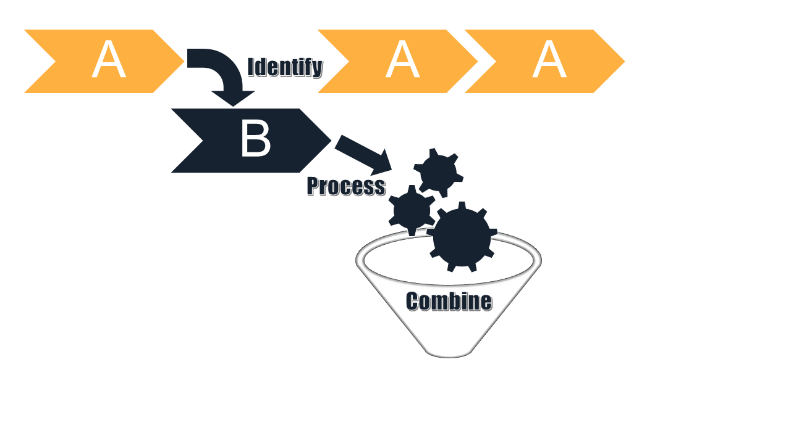

==========
Sectionary
==========

A package for **Identifying**, **Processing** and **Combining** "*Sections*" of
any sequence or input stream.

Features
--------

Define a section_ of a sequential source with:

1. Optional starting and ending conditions
2. Functions to be applied to each source element in the section
3. A method to merge all source elements into one object
